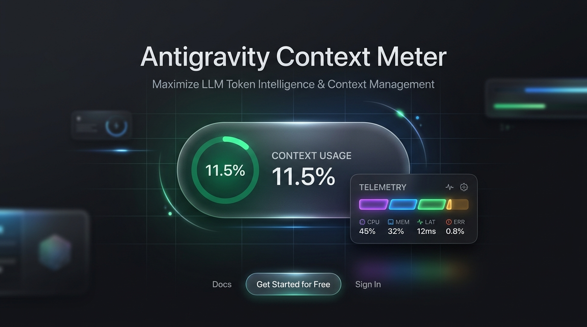
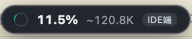
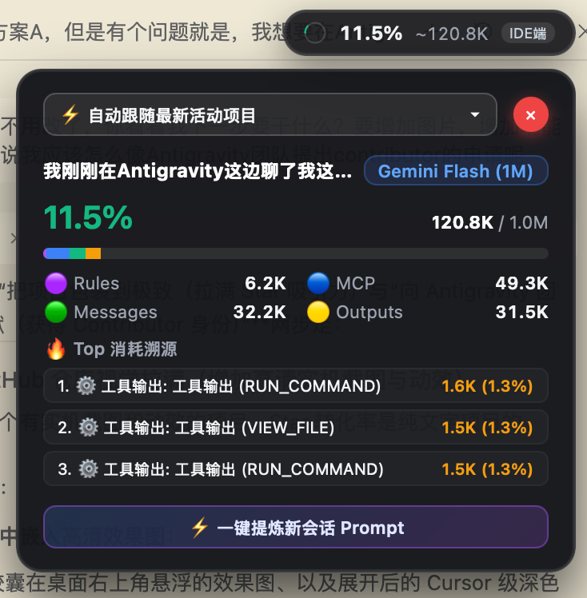
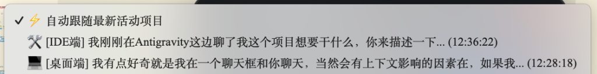

<div align="center">

# 💊 Antigravity Context Meter

<p align="center">
  <b>1:1 Minimalist Real-time Context Usage Meter & Zero-Loss Session Migration for Google Antigravity</b><br/>
  <i>High-precision local token tracking, HUD floating capsule, and smart continuity extraction.</i>
</p>

<p align="center">
  <b>English</b> •
  <a href="README_zh.md">简体中文</a>
</p>

<p align="center">
  <a href="https://github.com/Dunphil692/antigravity-context-meter/releases/latest"></a>
  <a href="LICENSE"></a>
  
  
  <a href="https://github.com/Dunphil692/antigravity-context-meter/stargazers"></a>
  <a href="https://github.com/Dunphil692/antigravity-context-meter/pulls"></a>
</p>

<p align="center">
  <a href="#-key-features">Key Features</a> •
  <a href="#-showcase">Showcase</a> •
  <a href="#-quick-start">Quick Start</a> •
  <a href="#-why-antigravity-context-meter">Why We Built This</a> •
  <a href="#-benchmarks">Benchmarks</a> •
  <a href="#-contributing">Contributing</a>
</p>

<br/>

<!-- Hero Banner -->
<p align="center">
  
</p>

<!-- Real-World UI Showcase -->
<p align="center">
  
  <br/><br/>
  
</p>

</div>

---

## 💡 Why Antigravity Context Meter?

When using **Google Antigravity** for multi-turn autonomous coding tasks, developers frequently face these challenges:

1. **Context Window Blindspot**: You never know when the token limit is reached until the agent begins **hallucinating, forgetting earlier architecture decisions, or degrading**.
2. **Checking Usage Wastes Tokens**: Asking the agent `/context` in chat consumes valuable tokens and pollutes the conversation history.
3. **Hard Context Transitions**: When reaching 80%~90% capacity, manually summarizing everything to start a fresh chat is slow and prone to missing key decisions.

**Antigravity Context Meter** solves this completely, featuring **zero-token local monitoring and 1-click zero-loss session migration**.

---

## ✨ Key Features

### 🎨 1. Minimalist Dark Frosted Glass UI
- **Dynamic Ring Meter**: Real-time percentage display with 4-level health alerts (Optimal / Moderate / Warning / Critical).
- **4-Color Breakdown Bar**: Clear visual breakdown for **Rules (System)**, **MCP (Tools)**, **Messages (Chat)**, and **Outputs (Tool dumps)**.
- **Native macOS Immersion**: Smooth `backdrop-filter: blur(28px)` dark HUD with native hardware rendering.

### ⚡ 2. Silent Zero-Token Local Tracking (0.039ms Engine)
- Powered entirely by local event-driven transcript streaming (`fs.watch` + SSE).
- **Zero API calls, Zero Prompts sent, 0 Token Cost**.
- Ultra-fast hybrid tokenizer executes in **0.039 ms** with **0.0% idle CPU footprint**.

### 🗂️ 3. Multi-Project & Multi-Session Pinning
- Auto-discovers all active projects and sessions across Antigravity Desktop and Antigravity IDE.
- Pin and monitor any specific project, or enable **⚡ Auto-follow latest active session**.

<p align="center">
  
</p>

### 🔥 4. Top 5 Token Consumers Profiling
- Pinpoint heavy tool calls, large file dumps, or verbose responses in milliseconds.

### 🚀 5. One-Click Zero-Loss Prompt Migration
- When crossing the 80% saturation threshold, click **`⚡ 1-Click Distill New Session Prompt`**.
- Instantly distill completed work, key technical decisions, and pending tasks to continue in a fresh session with **100% memory continuity**.

---

## 🖥️ Dual-Mode Architecture

Choose the mode that fits your workflow:

| Form Factor | Best For | Tech Stack | Footprint / Memory |
| :--- | :--- | :--- | :--- |
| **💊 Native macOS HUD Capsule** | Standalone Antigravity Desktop App, multi-screen setups | Objective-C Cocoa + WebKit | **Only 53 KB** / ~15MB RAM |
| **🛠️ IDE Status Bar Extension** | Antigravity IDE / VS Code embedded workflow | VS Code Extension API | **Only 68 KB** (.vsix) |

---

## 🚀 Quick Start

### Option A: Standalone macOS Floating Capsule

```bash
# 1. Clone this repository
git clone https://github.com/Dunphil692/antigravity-context-meter.git
cd antigravity-context-meter

# 2. Launch the floating capsule (runs in background, top-right of screen)
./start-capsule.sh

# 3. To stop / quit (or click the red [✕] button on the card):
./stop-capsule.sh
```

### Option B: Install Extension in Antigravity IDE / VS Code

1. Go to the [Releases Page](https://github.com/Dunphil692/antigravity-context-meter/releases/latest) and download `antigravity-context-meter-1.0.0.vsix`.
2. Open Antigravity IDE / VS Code, open Extensions (`Cmd+Shift+X`).
3. Click the `...` menu on the top-right -> Select **`Install from VSIX...`**.
4. The live context ring will appear in your status bar!

---

## 📊 Benchmarks

Stress-tested on M-series Mac with 100-turn chat history (200,000+ characters of real engineering logs):

| Metric | Antigravity Context Meter | Chat `/context` Prompt | Advantage |
| :--- | :---: | :---: | :---: |
| **API Token Cost** | **0 Tokens** | 1,000 ~ 5,000 Tokens per check | 🟢 **100% Free** |
| **Latency** | **0.039 ms** | 1.5 s ~ 3.0 s | 🟢 **50,000x Faster** |
| **Binary Size** | **53 KB** (Native) | - | 🟢 **Ultra Lightweight** |
| **Idle CPU Usage** | **0.0% ~ 0.1%** | - | 🟢 **Zero Battery Drain** |

---

## 🗺️ Roadmap

- [x] Minimalist dark frosted glass UI & 4-color breakdown bar
- [x] Multi-project and multi-session dropdown switcher with pinning
- [x] Native macOS floating HUD capsule with smooth screen dragging
- [x] 1-Click zero-loss structured prompt distillation
- [ ] Windows / Linux floating window support
- [ ] Customizable threshold alerts (e.g. desktop notification at 80%)
- [ ] Official Antigravity Plugin Marketplace distribution

---

## 🤝 Contributing

Contributions are warmly welcomed! Whether you want to file an issue, suggest improvements, or add support for new platforms:

1. **Fork** this repository
2. Create your feature branch (`git checkout -b feature/CoolFeature`)
3. Commit your changes (`git commit -m 'feat: Add CoolFeature'`)
4. Push to the branch (`git push origin feature/CoolFeature`)
5. Open a **Pull Request**

---

## 📄 License

This project is licensed under the [MIT License](LICENSE).

<div align="center">
  <sub>Made with ❤️ for the Antigravity Community</sub>
</div>
